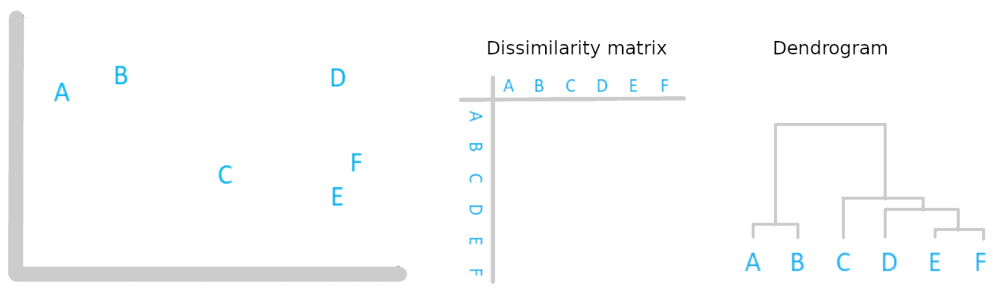
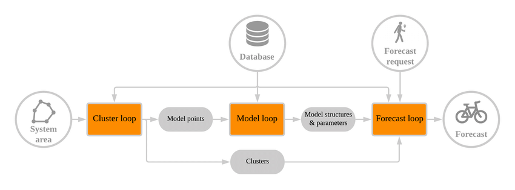
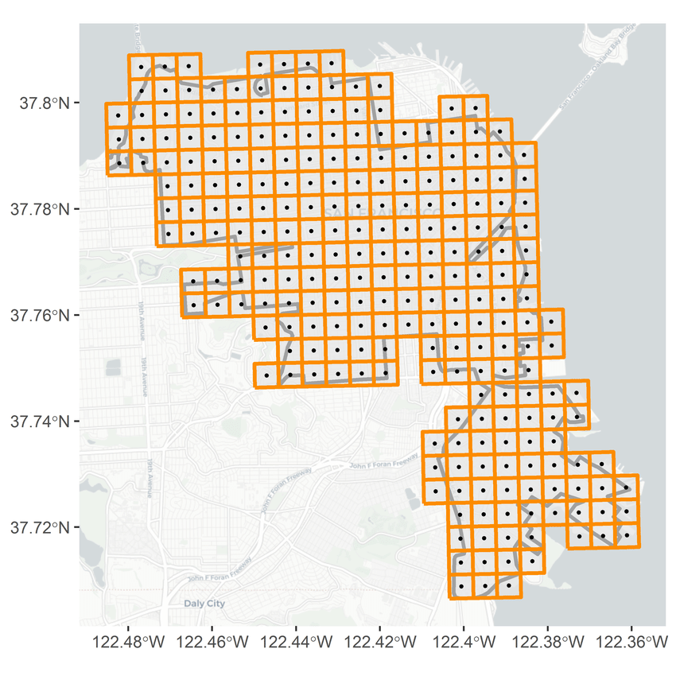
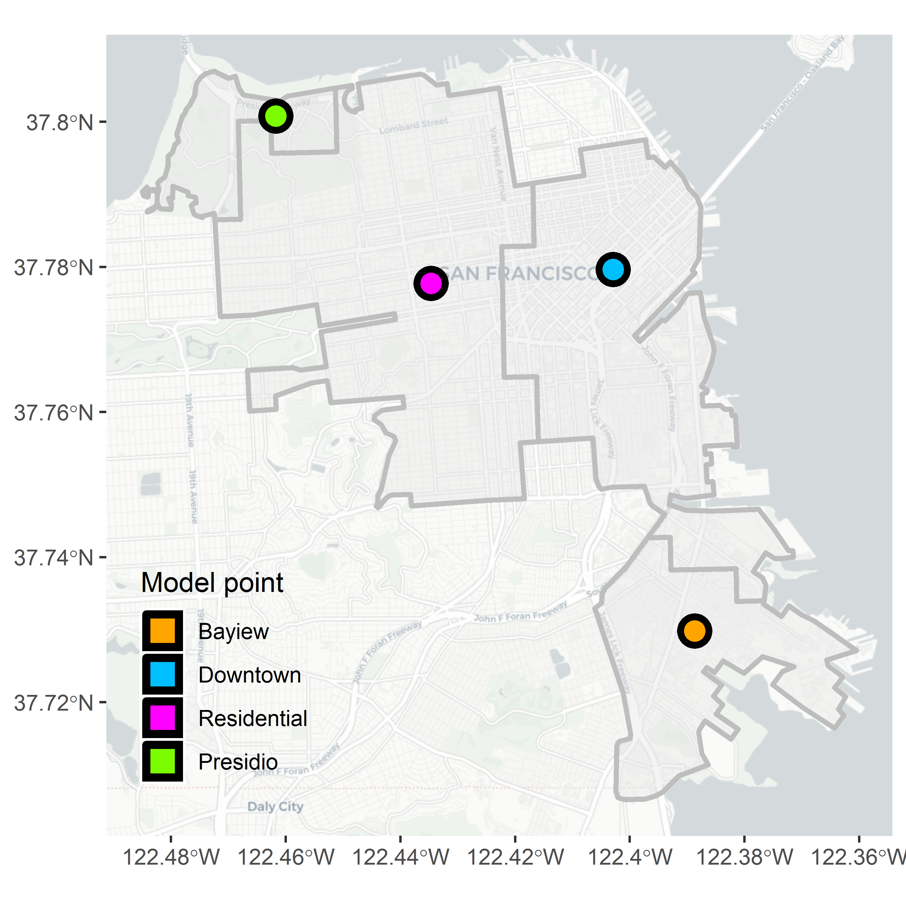

```{r setup, include=FALSE}
options(htmltools.dir.version = FALSE)
```

background-image: url('figures/zgis.png')
background-size: 80px
background-position: 50% 95%
class: center, middle

```{r, echo = FALSE, cache = TRUE, out.width='20%'}
knitr::include_graphics("figures/github.png")
```

Slides of this presentation at GitHub: [github.com/luukvdmeer/stig19](https://github.com/luukvdmeer/stig19)

---
background-image: url('figures/zgis.png')
background-size: 80px
background-position: 50% 95%
class: center, middle

# "Data science is concerned with finding answers to questions on the basis of available data"

### E. Pebesma & R. Bivand, 2019. [Spatial Data Science](https://keen-swartz-3146c4.netlify.com/)


---
background-image: url('figures/zgis.png')
background-size: 80px
background-position: 50% 95%
class: center, middle

```{r, echo = FALSE, cache = TRUE, out.width='70%'}
knitr::include_graphics("figures/spacetimecube.png")
```

Image credit: [Esri](https://pro.arcgis.com/en/pro-app/tool-reference/space-time-pattern-mining/create-space-time-cube.htm)

---
background-image: url('figures/zgis.png')
background-size: 80px
background-position: 50% 95%
class: center, middle

# "Creating sustainable transportation solutions is one of the greatest challenges facing cities today."

### [World Wide Fund For Nature](https://wwf.panda.org/our_work/projects/one_planet_cities/sustainable_mobility/)

---
background-image: url('figures/zgis.png')
background-size: 80px
background-position: 50% 95%
class: center

# Environment

"Around one-quarter of global CO2 emissions come from the transportation of people and goods" - [World Wide Fund For Nature, 2018](https://wwf.panda.org/our_work/projects/one_planet_cities/sustainable_mobility/)

"9 out of 10 people worldwide breathe polluted air" - [World Health Organization. 2018](https://www.who.int/news-room/detail/02-05-2018-9-out-of-10-people-worldwide-breathe-polluted-air-but-more-countries-are-taking-action)

"Air pollution causes 800,000 extra deaths a year in Europe and 8.8 million worldwide" - [European Society of Cardioligy, 2019](https://www.escardio.org/The-ESC/Press-Office/Press-releases/Air-pollution-causes-800-000-extra-deaths-a-year-in-Europe-and-8-8-million-worldwide)

---
background-image: url('figures/zgis.png')
background-size: 80px
background-position: 50% 95%
class: center

# Congestion

```{r, echo = FALSE, cache = TRUE, out.width='80%'}
knitr::include_graphics("figures/congestion.jpeg")
```

Image credit: [ABC](https://twitter.com/darrenrovell/status/801277592980652032)

Interested? Read [The Fundamental Law of Road Congestion](https://www.nber.org/papers/w15376)

---
background-image: url('figures/zgis.png')
background-size: 80px
background-position: 50% 95%
class: center

# Space requirements

```{r, echo = FALSE, cache = TRUE, out.width='70%'}

```

Image credit: [CycleToWorkDay](https://twitter.com/cycletoworkday/status/806826291290836992)

---
background-image: url('figures/zgis.png')
background-size: 80px
background-position: 50% 95%
class: center

# Space requirements

```{r, echo = FALSE, cache = TRUE, out.width='70%'}

```

Image credit: [CycleToWorkDay](https://twitter.com/cycletoworkday/status/806826291290836992)

---
background-image: url('figures/zgis.png')
background-size: 80px
background-position: 50% 95%
class: center

# Space requirements

```{r, echo = FALSE, cache = TRUE, out.width='70%'}

```

Image credit: [CycleToWorkDay](https://twitter.com/cycletoworkday/status/806826291290836992)

---
background-image: url('figures/zgis.png')
background-size: 80px
background-position: 50% 95%
class: center

# Space requirements

```{r, echo = FALSE, cache = TRUE, out.width='70%'}

```

Image credit: [CycleToWorkDay](https://twitter.com/cycletoworkday/status/806826291290836992)

---
background-image: url('figures/zgis.png')
background-size: 80px
background-position: 50% 95%
class: center

# Safety

```{r, echo = FALSE, cache = TRUE, out.width='80%'}

```

Image credit: [SWOV](https://www.swov.nl/)

---
background-image: url('figures/zgis.png')
background-size: 80px
background-position: 50% 95%
class: center

# Safety

```{r, echo = FALSE, cache = TRUE, out.width='80%'}

```

Image credit: [Kurier, 06.08.2019](https://www.pressreader.com/austria/kurier-3402/20190806)

---
background-image: url('figures/zgis.png')
background-size: 80px
background-position: 50% 95%
class: center

# Safety

<center><blockquote class="twitter-tweet"><p lang="en" dir="ltr">Hey <a href="https://twitter.com/KURIERat?ref_src=twsrc%5Etfw">@KURIERat</a>, I fixed that for you <a href="https://t.co/mq9NY4Zjh1">pic.twitter.com/mq9NY4Zjh1</a></p>&mdash; Helge Fahrnberger (@Helge) <a href="https://twitter.com/Helge/status/1158765321689411585?ref_src=twsrc%5Etfw">August 6, 2019</a></blockquote></center> <script async src="https://platform.twitter.com/widgets.js" charset="utf-8"></script>

---
background-image: url('figures/zgis.png')
background-size: 80px
background-position: 50% 95%
class: center, middle

# "Sustainable urban mobility requires a mind shift: where transport in private cars and trucking give way to different modes of transport."

### [World Wide Fund For Nature](https://wwf.panda.org/our_work/projects/one_planet_cities/sustainable_mobility/)

---
background-image: url('figures/zgis.png')
background-size: 80px
background-position: 50% 95%
class: center, middle

```{r, echo = FALSE, cache = TRUE, out.width='60%'}

```

Image credit: [Erik Griswold](https://twitter.com/erik_griswold/status/1165482859223629824)

---
background-image: url('figures/zgis.png')
background-size: 80px
background-position: 50% 95%
class: center, middle

```{r, echo = FALSE, cache = TRUE, out.width='45%'}

```

Image credit: [Karl Jilg](https://twitter.com/fietsprofessor/status/1182628284326174720)

---
background-image: url('figures/zgis.png')
background-size: 80px
background-position: 50% 95%
class: center, middle

```{r, echo = FALSE, cache = TRUE, out.width='80%'}

```

Image credit: [Taras Grescoe](https://twitter.com/grescoe/status/1060206830071279617)

---
background-image: url('figures/zgis.png')
background-size: 80px
background-position: 50% 95%
class: center, middle

<center><blockquote class="twitter-tweet" data-conversation="none"><p lang="en" dir="ltr">It exists in Delft. The only* traffic light purposely built to break up an endless stream of cyclists and allow a random car to enter a neighbourhood. (push button not included) <br><br>*) to my knowledge <a href="https://t.co/hdr8yv8Wdx">pic.twitter.com/hdr8yv8Wdx</a></p>&mdash; Lennart Nout (@lennartnout) <a href="https://twitter.com/lennartnout/status/1060533505606799360?ref_src=twsrc%5Etfw">November 8, 2018</a></blockquote></center> <script async src="https://platform.twitter.com/widgets.js" charset="utf-8"></script>

---
background-image: url('figures/zgis.png')
background-size: 80px
background-position: 50% 95%
class: center, middle

```{r, echo = FALSE, cache = TRUE, out.width='70%'}

```

Image credit: [Birgit Hebein](https://twitter.com/BirgitHebein/status/1184804850674163712)

---
background-image: url('figures/zgis.png')
background-size: 80px
background-position: 50% 95%
class: center, middle

```{r, echo = FALSE, cache = TRUE, out.width='70%'}

```

Image credit: [Birgit Hebein](https://twitter.com/BirgitHebein/status/1184804850674163712)

---
background-image: url('figures/zgis.png')
background-size: 80px
background-position: 50% 95%
class: center, middle

<center><blockquote class="twitter-tweet"><p lang="en" dir="ltr">”After 100 years, San Francisco is calling for an end to its disastrous pilot project for dockless personal vehicles, colloquially known as cars.” <a href="https://t.co/L45YMaEDlH">https://t.co/L45YMaEDlH</a></p>&mdash; Alexandra Sweet (@ASweetPlanner) <a href="https://twitter.com/ASweetPlanner/status/1187728624733941760?ref_src=twsrc%5Etfw">October 25, 2019</a></blockquote></center> <script async src="https://platform.twitter.com/widgets.js" charset="utf-8"></script>

---
background-image: url('figures/zgis.png')
background-size: 80px
background-position: 50% 95%
class: inverse, center, middle

# Spatio-Temporal Forecasts for Bike Availability in Dockless Bike Sharing Systems

---
background-image: url('figures/zgis.png')
background-size: 80px
background-position: 50% 95%
class: center

# What is dockless bike sharing?

.center[
.pull-left[
### Station based systems
```{r, echo = FALSE, cache = TRUE, out.width='70%'}

```
]

.pull-right[
### Dockless systems
```{r, echo = FALSE, cache = TRUE, out.width='70%'}
knitr::include_graphics("figures/dockless.png")
```
]
]

---
background-image: url('figures/zgis.png')
background-size: 80px
background-position: 50% 95%
class: center

# What do we need to make it a success?

.center[
.pull-left[
### Good bike infrastructure
```{r, echo = FALSE, cache = TRUE, out.width='70%'}
knitr::include_graphics("figures/infrastructure.png")
```
]

.pull-right[
### A reliable system
```{r, echo = FALSE, cache = TRUE, out.width='70%'}
knitr::include_graphics("figures/reliable.png")
```
]
]

---
background-image: url('figures/zgis.png')
background-size: 80px
background-position: 50% 95%
class: center

# What does a reliable system mean?

.center[
.pull-left[
### Station based systems
```{r, echo = FALSE, cache = TRUE, out.width='70%'}

```
]

.pull-right[
### Dockless systems
```{r, echo = FALSE, cache = TRUE, out.width='70%'}
knitr::include_graphics("figures/dockless.png")
```
]
]

---
background-image: url('figures/zgis.png')
background-size: 80px
background-position: 50% 95%
class: center

# How do forecasts increase reliability?

.center[
.pull-left[
### User perspective
```{r, echo = FALSE, cache = TRUE, out.width='70%'}
knitr::include_graphics("figures/users.png")
```
]

.pull-right[
### Operator perspective
```{r, echo = FALSE, cache = TRUE, out.width='70%'}

```
]
]

---
background-image: url('figures/zgis.png')
background-size: 80px
background-position: 50% 95%
class: center

# What to forecast?

.center[
.pull-left[
### Station based systems
```{r, echo = FALSE, cache = TRUE, out.width='70%'}

```
]

.pull-right[
### Dockless systems
```{r, echo = FALSE, cache = TRUE, out.width='70%'}
knitr::include_graphics("figures/dockless.png")
```
]
]

---
background-image: url('figures/zgis.png')
background-size: 80px
background-position: 50% 95%
class: center

# Grid based?

```{r, echo = FALSE, cache = TRUE, out.width='50%'}

```

---
background-image: url('figures/zgis.png')
background-size: 80px
background-position: 50% 95%
class: center

# Distance based

```{r, echo = FALSE, cache = TRUE, out.width='50%'}
knitr::include_graphics("figures/distancebased.png")
```

---
background-image: url('figures/zgis.png')
background-size: 80px
background-position: 50% 95%
class: center

# Challenges

.center[
.pull-left[
### Patterns over space
```{r, echo = FALSE, cache = TRUE, out.width='70%'}
knitr::include_graphics("figures/space.png")
```
]

.pull-right[
### Patterns over time
```{r, echo = FALSE, cache = TRUE, out.width='70%'}
knitr::include_graphics("figures/time.png")
```
]
]

---
background-image: url('figures/zgis.png')
background-size: 80px
background-position: 50% 95%
class: center, middle

# The time domain

```{r, echo = FALSE, cache = TRUE, out.width='40%'}
knitr::include_graphics("figures/time.png")
```

---
background-image: url('figures/zgis.png')
background-size: 80px
background-position: 50% 95%
class: center

# A time series

```{r, echo = FALSE, cache = TRUE, out.width='100%'}

```

---
background-image: url('figures/zgis.png')
background-size: 80px
background-position: 50% 95%
class: center

# Forecasting

```{r, echo = FALSE, cache = TRUE, out.width='100%'}

```

---
background-image: url('figures/zgis.png')
background-size: 80px
background-position: 50% 95%
class: center, middle

# Temporal autocorrelation!

---
background-image: url('figures/zgis.png')
background-size: 80px
background-position: 50% 95%
class: center

# Autoregressive models of order p: AR(p)

An autoregressive model of order p is based on the assumption that the current value of a time series is a linear combination of p previous values.

$$y_{t}=\phi_{1}y_{t-1}+\phi_{2}y_{t-2}+...+\phi_{p}y_{t-p}+\epsilon_{t}$$

---
background-image: url('figures/zgis.png')
background-size: 80px
background-position: 50% 95%
class: center

# Moving average models of order q: MA(q)

A moving average model of order q is based on the assumption that the current value of a time series is a linear combination of q previous errors.

$$y_{t}=\epsilon_{t}+\theta_{1}\epsilon_{t-1}+\theta_{2}\epsilon_{t-2}+...+\theta_{q}\epsilon_{t-q}$$

---
background-image: url('figures/zgis.png')
background-size: 80px
background-position: 50% 95%
class: center

# Together: an ARMA(p,q) model

AR(p) and MA(q) models can be combined into an autoregressive moving average model of order (p, q). That is, in such a model, the current value of a time series is assuned to be a linear combination of both p previous values and q previous errors.

$$y_{t}=\phi_{1}y_{t-1}+...+\phi_{p}y_{t-p}+\theta_{1}\epsilon_{t-1}+...+\theta_{q}\epsilon_{t-q}+\epsilon_{t}$$

---
background-image: url('figures/zgis.png')
background-size: 80px
background-position: 50% 95%
class: center

# On top of that: differencing

The first order difference (d = 1) of a time series is the series of changes from one time period to the next.

$$\nabla y_{t} = y_{t} - y_{t-1}$$

---
background-image: url('figures/zgis.png')
background-size: 80px
background-position: 50% 95%
class: center

# All together: ARIMA(p,d,q)

Auto Regressive Integrated Moving Average Model

$$\nabla^{d}y_{t}=\phi_{1}\nabla^{d}y_{t-1}+...+\phi_{p}\nabla^{d}y_{t-p}+\theta_{1}\epsilon_{t-1}+...+\theta_{q}\epsilon_{t-q}+\epsilon_{t}$$

---
background-image: url('figures/zgis.png')
background-size: 80px
background-position: 50% 95%
class: center

# But what with seasonality?

```{r, echo = FALSE, cache = TRUE, out.width='100%'}

```

---
background-image: url('figures/zgis.png')
background-size: 80px
background-position: 50% 95%
class: center

# Decomposition

```{r, echo = FALSE, cache = TRUE, out.width='90%'}

```

---
background-image: url('figures/zgis.png')
background-size: 80px
background-position: 50% 95%
class: center

# Challenges

$$\nabla^{d}y_{t}=\phi_{1}\nabla^{d}y_{t-1}+...+\phi_{p}\nabla^{d}y_{t-p}+\theta_{1}\epsilon_{t-1}+...+\theta_{q}\epsilon_{t-q}+\epsilon_{t}$$

.center[
.col-one[
### Accurate
```{r, echo = FALSE, cache = TRUE, out.width='70%'}

```
]

.col-two[
### Automated
```{r, echo = FALSE, cache = TRUE, out.width='70%'}

```
]

.col-three[
### Fast
```{r, echo = FALSE, cache = TRUE, out.width='70%'}

```
]
]

---
background-image: url('figures/zgis.png')
background-size: 80px
background-position: 50% 95%
class: center, middle

# The space domain

```{r, echo = FALSE, cache = TRUE, out.width='40%'}
knitr::include_graphics("figures/space.png")
```

---
background-image: url('figures/zgis.png')
background-size: 80px
background-position: 50% 95%
class: center, middle

# Spatial autocorrelation!

---
background-image: url('figures/zgis.png')
background-size: 80px
background-position: 50% 95%
class: center

# Time series over space

```{r, echo = FALSE, cache = TRUE, out.width='50%'}

```

---
background-image: url('figures/zgis.png')
background-size: 80px
background-position: 50% 95%
class: center

# Spatial clusters

```{r, echo = FALSE, cache = TRUE, out.width='50%'}

```

---
background-image: url('figures/zgis.png')
background-size: 80px
background-position: 50% 95%
class: center

# One 'model point' per spatial cluster

```{r, echo = FALSE, cache = TRUE, out.width='50%'}

```

---
background-image: url('figures/zgis.png')
background-size: 80px
background-position: 50% 95%
class: center

# Hierarchical clustering

```{r, echo = FALSE, cache = TRUE, out.width='100%'}

```

---
background-image: url('figures/zgis.png')
background-size: 80px
background-position: 50% 95%
class: center

# Hierarchical clustering of time series

```{r, echo = FALSE, cache = TRUE, out.width='40%'}

```

Image credit: [Xiaozhe Wang](https://www.semanticscholar.org/paper/1-Characteristic-based-Clustering-for-Time-Series/0a5e8d1390f3ceb851f4a37a7ec8edb95e05f698/figure/8)

---
background-image: url('figures/zgis.png')
background-size: 80px
background-position: 50% 95%
class: center

# Feature dissimilarity matrix

```{r, echo = FALSE, cache = TRUE, out.width='100%'}

```

Image credit: [Vinícius Mourão Alves de Souza](https://www.researchgate.net/figure/The-Euclidean-distance-between-two-time-series-can-be-visualized-as-the-square-root-of_fig14_254861501)

---
background-image: url('figures/zgis.png')
background-size: 80px
background-position: 50% 95%
class: center

# Spatial dissimilarity matrix

```{r, echo = FALSE, cache = TRUE, out.width='50%'}

```

---
background-image: url('figures/zgis.png')
background-size: 80px
background-position: 50% 95%
class: center

# Methodology overview

```{r, echo = FALSE, cache = TRUE, out.width='100%'}

```

---
background-image: url('figures/zgis.png')
background-size: 80px
background-position: 50% 95%
class: center

# Case study

```{r, echo = FALSE, cache = TRUE, out.width='100%'}

```

---
background-image: url('figures/zgis.png')
background-size: 80px
background-position: 50% 95%
class: center

# Time series for clustering

```{r, echo = FALSE, cache = TRUE, out.width='60%'}

```

---
background-image: url('figures/zgis.png')
background-size: 80px
background-position: 50% 95%
class: center

# Clusters

```{r, echo = FALSE, cache = TRUE, out.width='60%'}

```

---
background-image: url('figures/zgis.png')
background-size: 80px
background-position: 50% 95%
class: center

# Model points

```{r, echo = FALSE, cache = TRUE, out.width='60%'}

```

---
background-image: url('figures/zgis.png')
background-size: 80px
background-position: 50% 95%
class: center

# Cluster patterns

```{r, echo = FALSE, cache = TRUE, out.width='90%'}

```

---
background-image: url('figures/zgis.png')
background-size: 80px
background-position: 50% 95%
class: center

# Time series

```{r, echo = FALSE, cache = TRUE, out.width='90%'}

```

---
background-image: url('figures/zgis.png')
background-size: 80px
background-position: 50% 95%
class: center

# Forecast examples

```{r, echo = FALSE, cache = TRUE, out.width='90%'}

```

---
background-image: url('figures/zgis.png')
background-size: 80px
background-position: 50% 95%
class: center, middle

```{r, echo = FALSE, cache = TRUE, out.width='20%'}
knitr::include_graphics("figures/github.png")
```

All code on GitHub: [github.com/luukvdmeer/dockless](https://github.com/luukvdmeer/dockless)

---
background-image: url('figures/zgis.png')
background-size: 80px
background-position: 50% 95%
class: center

# Interested?

## Thesis available on [ResearchGate](https://www.researchgate.net/publication/336922318_Spatio-Temporal_Forecasts_for_Bike_Availability_in_Dockless_Bike_Sharing_Systems)
## Excellent (free!) book on time series forecasting: [Forecasting, Principles & Practice](https://otexts.com/fpp2/) by Rob Hyndman

---
background-image: url('figures/zgis.png')
background-size: 80px
background-position: 50% 95%
class: inverse, center, middle

# Vehicle Routing Problems

---
background-image: url('figures/zgis.png')
background-size: 80px
background-position: 50% 95%
class: center

# Optimize bus routes to events

```{r, echo = FALSE, cache = TRUE, out.width='60%'}

```

---
background-image: url('figures/zgis.png')
background-size: 80px
background-position: 50% 95%
class: center

# Optimize bus routes to events

```{r, echo = FALSE, cache = TRUE, out.width='60%'}

```

---
background-image: url('figures/zgis.png')
background-size: 80px
background-position: 50% 95%
class: center

# Traveling Salesman Problem

```{r, echo = FALSE, cache = TRUE, out.width='60%'}

```

---
background-image: url('figures/zgis.png')
background-size: 80px
background-position: 50% 95%
class: center

# 'Greedy' solution

```{r, echo = FALSE, cache = TRUE, out.width='60%'}

```

---
background-image: url('figures/zgis.png')
background-size: 80px
background-position: 50% 95%
class: center

# But this one is better...

```{r, echo = FALSE, cache = TRUE, out.width='60%'}

```

---
background-image: url('figures/zgis.png')
background-size: 80px
background-position: 50% 95%
class: center

# Total number of solutions with 3 cities

$$3\times2\times1=3!=6$$

# Total number of solutions with 100 cities

$$100\times99\times98\times...\times1=100!=...$$

# Therefore: use 'heuristics'

---
background-image: url('figures/zgis.png')
background-size: 80px
background-position: 50% 95%
class: center

# An example

```{r, echo = FALSE, cache = TRUE, out.width='100%'}
knitr::include_graphics("figures/santa1.png")
```

Example borrowed from [knowtex](http://www.knowtex.com/nav/vehicle-routing-and-heuristics-in-operations-research_41357)

---
background-image: url('figures/zgis.png')
background-size: 80px
background-position: 50% 95%
class: center

# Initial solution

```{r, echo = FALSE, cache = TRUE, out.width='100%'}

```

---
background-image: url('figures/zgis.png')
background-size: 80px
background-position: 50% 95%
class: center

# Local search

```{r, echo = FALSE, cache = TRUE, out.width='100%'}

```

---
background-image: url('figures/zgis.png')
background-size: 80px
background-position: 50% 95%
class: center

# Better solution

```{r, echo = FALSE, cache = TRUE, out.width='100%'}

```

---
background-image: url('figures/zgis.png')
background-size: 80px
background-position: 50% 95%
class: center

# Local search

```{r, echo = FALSE, cache = TRUE, out.width='100%'}

```

---
background-image: url('figures/zgis.png')
background-size: 80px
background-position: 50% 95%
class: center

# Local and global minima

```{r, echo = FALSE, cache = TRUE, out.width='80%'}

```

Image credit: [Yeon Byoungil](https://www.researchgate.net/figure/Example-of-local-and-global-solutions-in-an-optimization-problem_fig3_322270023)

---
background-image: url('figures/zgis.png')
background-size: 80px
background-position: 50% 95%
class: center

# Local and global minima

```{r, echo = FALSE, cache = TRUE, out.width='60%'}

```

Image credit: [Ryan Marks](https://www.researchgate.net/figure/A-3D-surface-plot-demonstrating-local-and-global-minima_fig10_305881922)

---
background-image: url('figures/zgis.png')
background-size: 80px
background-position: 50% 95%
class: center

# Including more constraints

```{r, echo = FALSE, cache = TRUE, out.width='100%'}

```

---
background-image: url('figures/zgis.png')
background-size: 80px
background-position: 50% 95%
class: inverse, center, middle

# Thank you!


